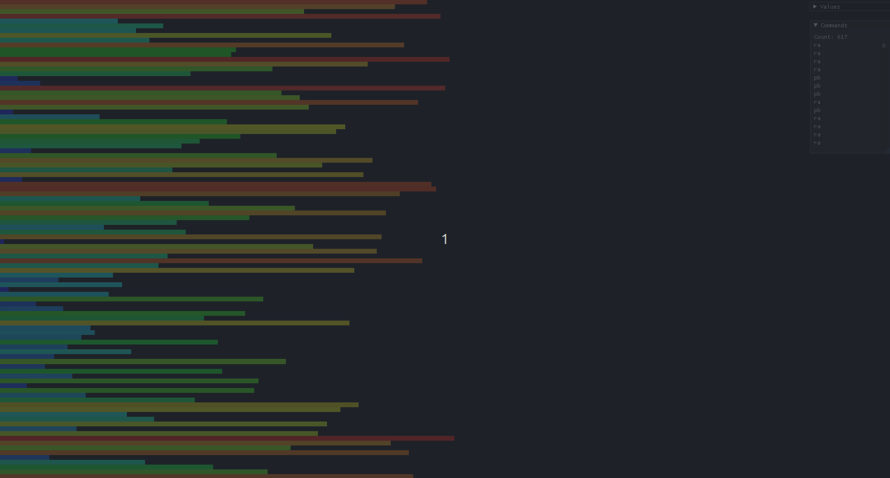

# push_swap

## Contents

<ul style="list-style-type:disc">
  <li><a href="#about">About</a></li>
  <li><a href="#moves">Moves</a></li>
  <li><a href="#mandatory">Mandatory</a></li>
  <li><a href="#bonus">Bonus</a></li>
  <li><a href="#usage">Usage</a></li>
  <li><a href="#visualization">Visualization</a></li>
  <li><a href="#norme">Norme</a></li>
</ul>

## About
Project from Rank 02 of 42 Porto Common Core. It's about exploring sorting algorithms and the objective is to sort a list of numbers with the least number of movements.

## Moves
|Command|Description|
|-|-|
|sa|Swap the first 2 elements at the top of stack a.|
|sb|Swap the first 2 elements at the top of stack b.|
|ss|sa and sb at the same time.|
|pa|Take the first element at the top of b and put it at the top of a.|
|pb|Take the first element at the top of a and put it at the top of b.|
|ra|Shift up all elements of stack a by 1.<br>The first element becomes the last one.|
|rb|Shift up all elements of stack b by 1.<br>The first element becomes the last one.|
|rr|ra and rb at the same time.|
|rra|Shift down all elements of stack a by 1.<br>The last element becomes the first one.|
|rrb|Shift down all elements of stack b by 1.<br>The last element becomes the first one.|
|rrr|rra and rrb at the same time.|

## Mandatory
Read and sort a valid list of numbers.<br>
A valid list would be: 45 -12 5 0 23 or "82 -2 928 -32 43 2"<br>
Anything else is handled as an error.

## Bonus
Implement a `checker`. The program will wait for you to input the commands you want to run to sort the list. If your moves sorted the list of numbers successfully it prints "OK" else it prints "KO".

## Usage
Compile using `make` and run `push_swap` with your list of numbers.
```sh
$ ./push_swap 45 -12 5 0 23
```
or
```sh
$ ./push_swap "45 -12 5 0 23"
```

For the bonus `make bonus` and run `checker`.
Here you're in charge of choosing the moves out of the [Movement table](#movement-table)
```sh
$ ./checker 45 -12 5 0 23
ra
pb
ra
pb
rra
pa
pa
OK
```

```sh
$ ./checker 45 -12 5 0 23
ra
pb
rra
KO
```

## Visualization
push_swap visualization with the help of <a href="https://github.com/o-reo/push_swap_visualizer">push_swap_vizualizer</a>.
<div>
	
</div>

## Norme

All 42 projects must be written following the **Norme**.

	- No for, do while, switch, case or goto are allowed
	- No more than 25 lines per function and 5 functions per file
	- No assigns and declarations in the same line (unless static)
 	- Each line must be at most 80 columns wide, comments included
	- A function can take 4 named parameters maximum
	- No more than 5 variables in 1 function
